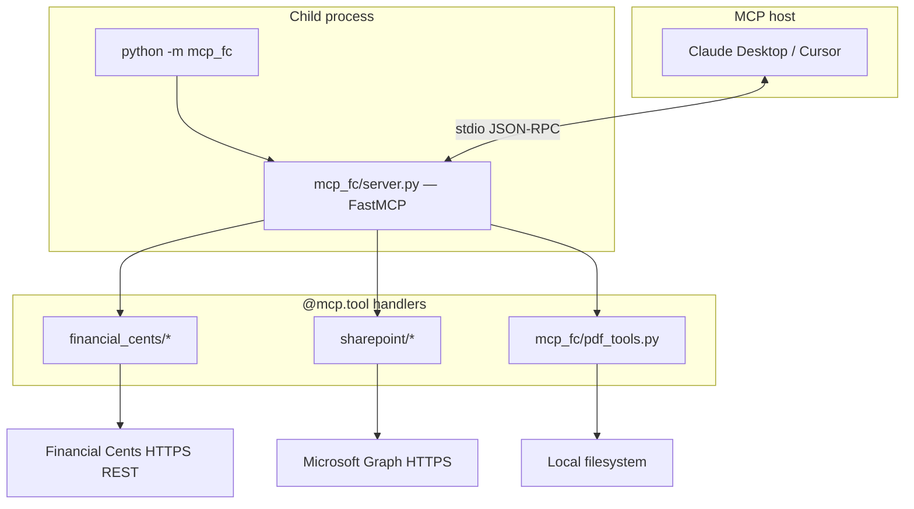

# MCP Financial Cents

**Financial Cents REST API** client + **MCP server** (stdio) exposing tools for clients, projects, tasks, invoices, time entries, **SharePoint** via Microsoft Graph, and **local PDF** text extraction.

---

## DOCUMENT MAP (READ ORDER FOR AI / NEW CONTRIBUTORS)

> ╔══════════════════════════════════════════════════════════════╗
> ║ DOCUMENT MAP (READ ORDER FOR AI / NEW CONTRIBUTORS)          ║
> ╚══════════════════════════════════════════════════════════════╝

| Section | What you learn |
|---------|----------------|
| [How this project runs](#how-this-project-runs) | End-to-end flow: host → process → modules → external systems. |
| [Repository layout](#repository-layout) | Which folder owns which responsibility. |
| [Configuration](#1-financial-cents-token-configuration) | Env vars and order: Financial Cents → SharePoint → Claude → run. |
| [Reference](#reference-authentication-summary) | REST shapes, MCP tools, errors, limits. |

---

## HOW THIS PROJECT RUNS

> ╔══════════════════════════════════════════════════════════════╗
> ║ HOW THIS PROJECT RUNS                                        ║
> ╚══════════════════════════════════════════════════════════════╝

### One-sentence model

An **MCP host** (Claude Desktop, Cursor, or another MCP client) **starts a child process** that runs this package’s MCP server on **stdio**; the server registers **tools** that call the **Financial Cents HTTP API**, **Microsoft Graph** (SharePoint), or **read local PDFs**.

### Execution chain

1. **Process entry:** `python -m mcp_fc` (or console script `financial-cents-mcp`) → `mcp_fc/__main__.py` → `mcp.run()` on the FastMCP instance.
2. **Server object:** `mcp_fc/server.py` builds `mcp = FastMCP(...)` and attaches tools with `@mcp.tool()`.
3. **Financial Cents calls:** Tool handlers call functions under `financial_cents/` (e.g. `clients.py`, `projects.py`). Those use `financial_cents/http_client.py` (`httpx`) with `FinancialCentsSettings` from `financial_cents/config.py` (`load_dotenv`, `FINANCIAL_CENTS_API_TOKEN`, optional base URL).
4. **SharePoint / Graph:** Tools use `sharepoint/sharepoint_provider.py` (`SharePointProvider`): **MSAL** client-credentials → **Graph REST** (sites, drives, items, download content).
5. **PDF:** `mcp_fc/pdf_tools.py` uses **pypdf** on local file paths (after optional download via SharePoint tools).
6. **Return value:** Each tool returns a **JSON string** (pretty-printed). Financial Cents paths wrap errors via `_call_api` (`configuration_error`, `http_error`, …). SharePoint tools return `sharepoint_error` JSON on failure.

### Diagram



### Important implementation details (for debugging)

- **No separate HTTP server:** Everything is **stdio**; there is no Flask/uvicorn port unless you wrap this differently yourself.
- **Shared `httpx` client** for Financial Cents (`http_client.py`) and separate pooling for Graph in `SharePointProvider`.
- **Project list `status` filter** (`open` / `closed`) is applied **in Python** after the API returns a page (`financial_cents/projects.py`) — pagination metadata may not match filtered row counts.

---

## REPOSITORY LAYOUT

> ╔══════════════════════════════════════════════════════════════╗
> ║ REPOSITORY LAYOUT                                            ║
> ╚══════════════════════════════════════════════════════════════╝

| Path | Role |
|------|------|
| `mcp_fc/` | MCP layer: `server.py` (FastMCP tools), `__main__.py` (entry), `pdf_tools.py`. |
| `financial_cents/` | REST client: `config.py`, `http_client.py`, resource modules (`clients`, `projects`, `invoices`, …). |
| `sharepoint/` | Graph access: `sharepoint_provider.py`, `base.py` (folder/file dataclasses). |
| `scripts/run_mcp.ps1`, `run_mcp.sh` | Run MCP from repo root (`uv run` → `.venv` → `python`). |
| `tests/` | Pytest coverage for client and MCP behavior. |

---

## KEY DEPENDENCIES

> ╔══════════════════════════════════════════════════════════════╗
> ║ KEY DEPENDENCIES                                             ║
> ╚══════════════════════════════════════════════════════════════╝

Declared in `pyproject.toml`: `httpx`, `mcp` (FastMCP), `msal`, `python-dotenv`, `pypdf`. Python **≥ 3.10**.

---

## LIVING DOCUMENTATION

> ╔══════════════════════════════════════════════════════════════╗
> ║ LIVING DOCUMENTATION                                         ║
> ╚══════════════════════════════════════════════════════════════╝

Whenever the team learns something important (API quirks, limits, Azure/SharePoint behavior), **update this file** and **commit + push** so humans and AI sessions stay aligned.

**Tip:** For field-level mapping work, share the **REST** / **MCP tools** reference sections and env **names** only (never secret values).

---

## 1) FINANCIAL CENTS TOKEN CONFIGURATION

> ╔══════════════════════════════════════════════════════════════╗
> ║ 1) FINANCIAL CENTS TOKEN CONFIGURATION                        ║
> ╚══════════════════════════════════════════════════════════════╝

Set these in a `.env` file at the **repository root** (loaded by `python-dotenv` — see `financial_cents/config.py`) or export them / pass them in MCP `env`.

| Variable | Required | Description |
|----------|----------|-------------|
| `FINANCIAL_CENTS_API_TOKEN` | **Yes** | API token. Sent as `Authorization: Bearer <token>`. |
| `FINANCIAL_CENTS_BASE_URL` | No | Default: `https://app.financial-cents.com/api/v1` |

**Behavior:** Static bearer token — **no** refresh in code. **Financial Cents tokens expire every ~6 months**, so plan to rotate/update the token in Financial Cents when it expires.

**Example `.env` (do not commit real secrets):**

```env
FINANCIAL_CENTS_API_TOKEN=your-token-here
FINANCIAL_CENTS_BASE_URL=https://app.financial-cents.com/api/v1
```

If the process **cwd** is not the repo root, dotenv may not find `.env` — set variables explicitly or set `cwd` in the Claude config.

---

## 2) SHAREPOINT CONFIGURATION

> ╔══════════════════════════════════════════════════════════════╗
> ║ 2) SHAREPOINT CONFIGURATION                                   ║
> ╚══════════════════════════════════════════════════════════════╝

SharePoint uses **Microsoft Graph** with OAuth2 **client credentials** (app-only) via MSAL. Scope `https://graph.microsoft.com/.default`. Tokens are cached in-process (`expires_in` minus **60s**). On **401**, the client refreshes the token and retries once.

### Required (Azure app)

| Variable | Required | Notes |
|----------|----------|--------|
| `TENANT_ID` | Yes* | Azure AD tenant ID. |
| `CLIENT_ID` | Yes* | App registration ID. |
| `CLIENT_SECRET` | Yes* | Client secret. |

\* Aliases: `AZURE_TENANT_ID`, `AZURE_CLIENT_ID`, `AZURE_CLIENT_SECRET`.

**Note:** Azure **client secrets** (the value behind `CLIENT_SECRET`) commonly have an expiration policy (often **~6 months**). If the secret expires, Graph auth will fail and you must create a new secret in Azure and update `.env` / the MCP `env` block.

### Site and drive

| Variable | Default (in code) | Meaning |
|----------|-------------------|---------|
| `SHAREPOINT_SITE_HOST` | `1vwr10.sharepoint.com` | SharePoint host. |
| `SHAREPOINT_SITE_PATH` | `/sites/Automation` | Server-relative site path. |
| `SHAREPOINT_DRIVE_NAME` | `Documents` | Document library name. |
| `SHAREPOINT_TIMEOUT_SECONDS` | `60` | Graph HTTP timeout (seconds). |
| `SHAREPOINT_TY_FOLDER` | (e.g. `Financial Cents Document`) | TY folder name for MCP helpers. |

**Azure:** Application permissions on Graph (e.g. `Sites.Read.All` / `Sites.ReadWrite.All`) + **admin consent**.

**Example `.env` additions:**

```env
TENANT_ID=your-tenant-id
CLIENT_ID=your-client-id
CLIENT_SECRET=your-client-secret
SHAREPOINT_SITE_HOST=yourtenant.sharepoint.com
SHAREPOINT_SITE_PATH=/sites/YourSite
SHAREPOINT_DRIVE_NAME=Documents
SHAREPOINT_TY_FOLDER=Financial Cents Document
```

---

## 3) CLAUDE CONFIGURATION

> ╔══════════════════════════════════════════════════════════════╗
> ║ 3) CLAUDE CONFIGURATION                                       ║
> ╚══════════════════════════════════════════════════════════════╝

MCP uses **stdio**: the host spawns your command and talks over stdin/stdout. Install this package in the **same Python** you put in the config. Use **`cwd`** = repo root for `.env`, or put secrets in **`env`** (most reliable).

### Claude Desktop

1. Install the project (`uv sync` or `pip install -e .`) so `python -m mcp_fc` works.
2. Config file:
   - **Windows:** `C:\Users\<YOU>\AppData\Roaming\Claude\claude_desktop_config.json`
   - **macOS:** `~/Library/Application Support/Claude/claude_desktop_config.json`
3. Add under `mcpServers` (replace paths and placeholders):

```json
{
  "mcpServers": {
    "financial-cents": {
      "command": "C:\\path\\to\\MCP-Financial-Cents\\.venv\\Scripts\\python.exe",
      "args": ["-m", "mcp_fc"],
      "cwd": "C:\\path\\to\\MCP-Financial-Cents",
      "env": {
        "FINANCIAL_CENTS_API_TOKEN": "your-token-here",
        "FINANCIAL_CENTS_BASE_URL": "https://app.financial-cents.com/api/v1",
        "TENANT_ID": "your-tenant-id",
        "CLIENT_ID": "your-client-id",
        "CLIENT_SECRET": "your-client-secret",
        "SHAREPOINT_SITE_HOST": "yourtenant.sharepoint.com",
        "SHAREPOINT_SITE_PATH": "/sites/YourSite",
        "SHAREPOINT_DRIVE_NAME": "Documents",
        "SHAREPOINT_TY_FOLDER": "Financial Cents Document"
      }
    }
  }
}
```

**Notes:** Windows JSON paths: double `\\` or forward slashes. If `cwd` is the repo root and `.env` exists, you can omit duplicate `env` keys — **explicit `env` is still safest**. If `uv` is on `PATH`:

```json
{
  "mcpServers": {
    "CCH Axcess": {
      "command": "<UV_PATH>\\\\uv.exe",
      "args": [
        "run",
        "--with",
        "mcp[cli]",
        "--with-editable",
        "<REPO_PATH>",
        "mcp",
        "run",
        "<REPO_PATH_POSIX>/main.py:mcp",
        "--transport",
        "stdio"
      ],
      "cwd": "<REPO_PATH>"
    }
  }
}
```

Restart Claude Desktop after changes.

### Verify after connecting

Run tools **`financial_cents_check_connection`** and **`sharepoint_check_connection`**.

---

## 4) HOW TO RUN THIS PROJECT

> ╔══════════════════════════════════════════════════════════════╗
> ║ HOW TO RUN THIS PROJECT                                    ║
> ╚══════════════════════════════════════════════════════════════╝

### Prerequisites

- Python **≥ 3.10**
- **Recommended:** `uv sync` (`pyproject.toml` + `uv.lock`).
- **Alternatively:** `pip install -e .` or `pip install -r requirements.txt`.

### Run the MCP server (stdio)

Entry point: `financial-cents-mcp` → `mcp_fc.__main__:run` → FastMCP stdio.

```bash
financial-cents-mcp
```

From **repository root**, `scripts/run_mcp.ps1` / `run_mcp.sh` prefer **`uv run`**, then **`.venv`**, then **`python`**.

**Check for `uv`:**

```bash
uv --version
```

- If a version prints, run **`uv sync`** once, then use the scripts or `uv run python -m mcp_fc`.
- If missing, install [uv](https://docs.astral.sh/uv/getting-started/installation/) or use `pip install -e .` and `python -m mcp_fc`.

**Windows (PowerShell):**

```powershell
.\scripts\run_mcp.ps1
```

**macOS / Linux:**

```sh
./scripts/run_mcp.sh
```

**Manual:**

```bash
uv run python -m mcp_fc
```

Without `uv`, use the interpreter where the package is installed:

```bash
python -m mcp_fc
```

Set env vars from sections **1** and **2** (or place `.env` in the working directory) before starting.

### Tests

```bash
pytest
```

Dev dependency: `pytest` (optional group in the project).

---

## REFERENCE: AUTHENTICATION SUMMARY

> ╔══════════════════════════════════════════════════════════════╗
> ║ REFERENCE: AUTHENTICATION SUMMARY                             ║
> ╚══════════════════════════════════════════════════════════════╝

| System | Method |
|--------|--------|
| Financial Cents | Bearer `FINANCIAL_CENTS_API_TOKEN` — no auto-refresh. |
| Microsoft Graph | MSAL client credentials; token cache; retry on 401. |

---

## FULL API INVENTORY (ALL ENDPOINTS USED BY THIS REPO)

> ╔══════════════════════════════════════════════════════════════╗
> ║ FULL API INVENTORY (ALL ENDPOINTS USED BY THIS REPO)          ║
> ╚══════════════════════════════════════════════════════════════╝

This is the **complete list of HTTP API endpoints** the current code calls, grouped by system.

### Financial Cents REST API

Base: `{FINANCIAL_CENTS_BASE_URL}` (default `https://app.financial-cents.com/api/v1`)

- **GET** `/clients`
  - **Query**: `order_by`, `order_dir`, `page`, optional search triple (`search[field]`, `search[operation]`, `search[value]`)
- **GET** `/clients/{client_id}`
- **POST** `/clients`
  - **Body**: form fields (`display_name` required; `contact_name`, `contact_email`, `contact_address`, `contact_notes` optional)

- **GET** `/projects`
  - **Query**: `order_by`, `order_dir`, `page`, optional search triple
  - **Note**: code supports a **client-side** filter `status=open|closed|all` (not an API query parameter)

- **GET** `/projects/{project_id}/resources`
  - **Query**: optional sort (`order_by`, `order_dir`), optional search triple
- **GET** `/clients/{client_id}/resources`
  - **Query**: optional sort (`order_by`, `order_dir`), optional search triple

- **GET** `/client-tasks`
  - **Query**: `order_by`, `order_dir`, `page`, `project_status`, optional `is_completed`, optional `limit`, optional search triple

- **GET** `/time-activities`
  - **Query**: optional `date_range[start]`, `date_range[end]` (YYYY-MM-DD), optional `client_id`, optional `user_id`

- **GET** `/invoices`
  - **Query**: `order_by`, `order_dir`, `page`

### Microsoft Graph (SharePoint)

Base: `https://graph.microsoft.com/v1.0`

- **GET** `/sites/{host}:{server-relative-site-path}`
  - Resolve SharePoint `site_id`
- **GET** `/sites/{site_id}/drives`
  - Resolve `drive_id` by `SHAREPOINT_DRIVE_NAME`
- **GET** `/drives/{drive_id}/root/search(q='{query}')?$top=200`
  - Search folder by name (returns up to 200)
- **GET** `/drives/{drive_id}/items/{folder_id}/children?$top=999&$select=id,name,webUrl,parentReference,size,folder,file`
  - List folders/files directly under a folder (returns up to 999; no `@odata.nextLink` paging implemented)
- **GET** `/drives/{drive_id}/items/{file_id}?$select=id,name,webUrl,parentReference,size,file`
  - File metadata
- **GET** `/drives/{drive_id}/items/{file_id}/content`
  - Download file content (redirects; code follows redirects)
- **GET** `/shares/{share_id}/driveItem?$select=id,name,webUrl,parentReference,size,file`
  - Resolve a SharePoint sharing link to a driveItem

---

## REST API REFERENCE — INPUT / OUTPUT FOR MAPPING

> ╔══════════════════════════════════════════════════════════════╗
> ║ REST API REFERENCE — INPUT / OUTPUT FOR MAPPING              ║
> ╚══════════════════════════════════════════════════════════════╝

Base URL: `{FINANCIAL_CENTS_BASE_URL}` (default `/api/v1`).

**General:**

- **GET** responses are JSON **objects**; list endpoints typically return a `data` array and often pagination metadata (e.g. `meta`).
- **Search:** `search[field]`, `search[operation]`, and `search[value]` are sent **only when all three are set**.
- **HTTP timeout:** Default **30 seconds** per request (`financial_cents/http_client.py`).

### `GET /clients`

| Query | Meaning |
|-------|---------|
| `order_by` | `created_at` \| `updated_at` \| `name` |
| `order_dir` | `asc` \| `desc` |
| `page` | Page number |
| `search[field]` | `name` (when the full search triple is set) |
| `search[operation]` | `equals` \| `beginswith` \| `endswith` \| `contains` |
| `search[value]` | Search string |

**Output:** JSON `dict` (usually includes `data`, …).

### `GET /clients/{client_id}`

| Input | Meaning |
|-------|---------|
| Path `client_id` | Client ID (URL-encoded when needed). |

**Output:** JSON `dict` for one client.

### `POST /clients`

| Form field | Required |
|------------|----------|
| `display_name` | Yes |
| `contact_name`, `contact_email`, `contact_address`, `contact_notes` | No |

**Output:** JSON `dict`.

### `GET /projects`

| Query | Meaning |
|-------|---------|
| `order_by` | `created_at` \| `title` |
| `order_dir` | `asc` \| `desc` |
| `page` | Page number |
| Search triple | `search[field]` = `title`, plus `operation` / `value` |

**Output:** `dict` with `data` as a list of projects; items usually include `is_closed`, `closed_at`, `closed_by`.

**Special behavior in code:** The `status` parameter (`open` \| `closed` \| `all`) **filters client-side** using `is_closed`. When filtering `open`/`closed`, **`meta` still reflects the API page**, but `data` may be shorter than the page size after filtering.

### `GET /projects/{project_id}/resources`

| Input | Meaning |
|-------|---------|
| Path `project_id` | Project ID |
| `order_by` | `created_at` \| `label` \| `list_index` (optional) |
| `order_dir` | `asc` \| `desc` (optional) |
| Search triple | `search[field]` is often `label` |

**Output:** `dict`; `data[]` often includes `id`, `project_id`, `anchor_id`, `label`, `url`, `list_index`, `type`, `created_at`, …

### `GET /clients/{client_id}/resources`

Same idea as project resources; `data[]` may include `client_id`, `label`, `url`, …

### `GET /client-tasks`

| Query | Meaning |
|-------|---------|
| `order_by` | `due_date` |
| `order_dir` | `asc` \| `desc` |
| `page` | Page number |
| `project_status` | `open` \| `closed` \| `all` (parent project) |
| `is_completed` | Boolean (optional) |
| `limit` | Row cap (when set, often **10–200**; if omitted, API default applies) |
| Search triple | `search[field]`: `title` \| `client_name` |

**Output:** JSON `dict`.

### `GET /time-activities`

| Query | Meaning |
|-------|---------|
| `date_range[start]`, `date_range[end]` | Mapped from `date_range_start` / `date_range_end` in code; format **`YYYY-MM-DD`** |
| `client_id` | int, optional |
| `user_id` | int, optional |

**Output:** `dict`; items in `data` often have `id`, `date`, `hours`, `comments`, nested `user`, …

### `GET /invoices`

| Query | Meaning |
|-------|---------|
| `order_by` | `created_at` \| `updated_at` \| `invoice_date` \| `due_date` \| `amount_due` |
| `order_dir` | `asc` \| `desc` |
| `page` | Page number |

**Output:** JSON `dict`.

---

## MICROSOFT GRAPH (SHAREPOINT) — URLS USED IN CODE

> ╔══════════════════════════════════════════════════════════════╗
> ║ MICROSOFT GRAPH (SHAREPOINT) — URLS USED IN CODE             ║
> ╚══════════════════════════════════════════════════════════════╝

- Site: `GET https://graph.microsoft.com/v1.0/sites/{host}:{server-relative-path}`
- Drives: `GET https://graph.microsoft.com/v1.0/sites/{site-id}/drives`
- Folder search: `GET .../drives/{drive-id}/root/search(q='...')?$top=200`
- Folder children: `GET .../drives/{drive-id}/items/{folder-id}/children?$top=999&$select=...`
- File metadata: `GET .../items/{item-id}?$select=...`
- File content: `GET .../items/{item-id}/content` (redirect; download uses `follow_redirects=True`)

**Limits:**

- Children list uses `$top=999` — folders with more items need extra pagination (code does **not** follow `@odata.nextLink` yet).
- Folder search uses `$top=200` results.

---

## MCP TOOLS — INPUT / OUTPUT (JSON STRINGS)

> ╔══════════════════════════════════════════════════════════════╗
> ║ MCP TOOLS — INPUT / OUTPUT (JSON STRINGS)                    ║
> ╚══════════════════════════════════════════════════════════════╝

Every tool returns a **single JSON string** for the host/AI to parse.

### Financial Cents

| Tool | Main inputs | Success output |
|------|-------------|----------------|
| `financial_cents_check_connection` | — | `{ "ok", "base_url", "message" }` |
| `financial_cents_list_clients` | `order_by`, `order_dir`, `page`, search triple | API payload |
| `financial_cents_get_client` | `client_id` | One client |
| `financial_cents_create_client` | `display_name`, contact fields | Create response |
| `financial_cents_list_projects` | + `status` | Projects (possibly filtered `open`/`closed`) |
| `financial_cents_list_project_resources` | `project_id`, sort, search | Resources |
| `financial_cents_list_client_resources` | `client_id`, sort, search | Resources |
| `financial_cents_list_client_tasks` | sort, `page`, `project_status`, `is_completed`, `limit`, search | Tasks |
| `financial_cents_list_time_activities` | `date_range_*`, `client_id`, `user_id` | Time entries |
| `financial_cents_list_invoices` | `order_by`, `order_dir`, `page` | Invoices |

### SharePoint

| Tool | Notes |
|------|--------|
| `sharepoint_check_connection` | Returns resolved `site` and `drive` ids. |
| `sharepoint_list_root` / `sharepoint_list_folder` | Use `folder_id` = `'root'` for drive root. |
| `sharepoint_find_client_folder` | Find folder by name (Graph search). |
| `sharepoint_resolve_folder_chain` | Nested folder names, exact segments. |
| `sharepoint_get_file_metadata` | By `file_id`. |
| `sharepoint_list_ty_folder` | Uses `SHAREPOINT_TY_FOLDER` or default in docstring. |
| `sharepoint_download_file` | `file_id` or alias `item_id`; `download_path`, `contact_key`, `overwrite`. |
| `sharepoint_download_file_by_name` | Resolve by file name in folder (or TY folder). |
| `sharepoint_download_folder` | Recursive download; `errors[]` per failed file. |
| `sharepoint_download_and_extract_pdf_text` | Download + `local_extract_pdf_text`. |

### Local PDF

| Tool | Inputs | Output |
|------|--------|--------|
| `local_extract_pdf_text` | `local_path`, `max_pages` (default 25, max 500), `max_chars` (default 200k), `include_pages` | `text`, `page_count`, etc. |

**Note:** Text extraction only (**not OCR**); scanned PDFs may return little or no text.

---

## STANDARD ERROR PAYLOADS (MCP)

> ╔══════════════════════════════════════════════════════════════╗
> ║ STANDARD ERROR PAYLOADS (MCP)                                ║
> ╚══════════════════════════════════════════════════════════════╝

### Financial Cents (`_call_api`)

| `error` | When |
|---------|------|
| `configuration_error` | `ValueError` (e.g. missing token). |
| `http_error` | `httpx.HTTPStatusError` — includes `status_code`, `detail` (body truncated ~2000 chars). |
| `request_error` | Network/transport `httpx.RequestError`. |
| `unexpected_error` | `TypeError`, `OSError`, … |

### SharePoint

| `error` | When |
|---------|------|
| `sharepoint_error` | `RuntimeError` (auth/config/Graph), `FileNotFoundError`, `ValueError`, `OSError`, … |

### PDF

| `error` | When |
|---------|------|
| `pdf_extract_error` | Missing file, not a PDF, character limits, etc. |

---

## BEST PRACTICES (FROM CURRENT CODE)

> ╔══════════════════════════════════════════════════════════════╗
> ║ BEST PRACTICES (FROM CURRENT CODE)                           ║
> ╚══════════════════════════════════════════════════════════════╝

1. Run **`financial_cents_check_connection`** / **`sharepoint_check_connection`** after changing env or deploying.
2. **Do not commit** secrets in `.env`.
3. **Search:** Always pass all three: `search[field]`, `search[operation]`, `search[value]`.
4. **Pagination:** Iterate `page` until no more data (using API `meta` when present).
5. **Projects `open`/`closed`:** Client-side filtering — you may need more pages after filtering.
6. **SharePoint downloads on Windows:** Linux-style paths (`/mnt/...`) from the host are ignored; server falls back to default download dir (`mcp_fc/server.py`, `_download_base_dir`).
7. **Graph token:** After rotating an Azure secret, restart the MCP process if needed.
8. **Shared HTTP client:** `httpx` is reused (connection pooling) when extending code.

---

## ERRORS AND EXCEPTIONS TO HANDLE

> ╔══════════════════════════════════════════════════════════════╗
> ║ ERRORS AND EXCEPTIONS TO HANDLE                              ║
> ╚══════════════════════════════════════════════════════════════╝

| Context | Handle |
|---------|--------|
| Financial Cents | `401` / `403`; `429` if returned; `5xx` — retry with backoff (not in client yet). |
| Missing config | `ValueError` from `FinancialCentsSettings.from_env()`. |
| Graph | `401`/`403` — Azure permissions; `404` — wrong site/drive/item. |
| SharePoint folder/file | `FileNotFoundError` when not found. |
| PDF | `FileNotFoundError`; malformed pages skipped in extractor. |

---

## CONSTRAINTS AND LIMITS

> ╔══════════════════════════════════════════════════════════════╗
> ║ CONSTRAINTS AND LIMITS                                       ║
> ╚══════════════════════════════════════════════════════════════╝

| Item | Value / notes |
|------|----------------|
| Financial Cents timeout | **30s** per request (default). |
| SharePoint Graph timeout | **`SHAREPOINT_TIMEOUT_SECONDS`** (default **60s**). |
| HTTP connections | `httpx.Limits(max_connections=50, max_keepalive_connections=20)` (FC client). |
| PDF `local_extract_pdf_text` | `max_pages` **1–500**; `max_chars` **1k–2M** (default 200k). |
| MCP inline PDF | `_MAX_INLINE_BYTES` in `server.py` reserved for future use. |
| Graph list children | `$top=999` — large folders may need pagination. |
| Financial Cents rate limits | **Not documented in code** — add when known. |

---


